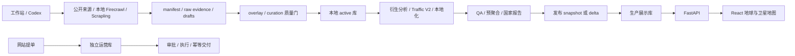

# iSite2 产品与工程交接总册

核验日期：2026-09-28。适用对象：运营、研究/扫网、开发运维，以及 Codex 或其他能读文件、执行命令的 agent。

代码：[syoumoku/iSite](https://github.com/syoumoku/iSite)（私有）；现有网站：[isite.cloud](https://isite.cloud/ui/)。账号、服务器登录方式和业务数据单独受控交接，不写进 Git。

## 1. 接手顺序

1. 获得仓库权限，clone 后把**仓库根目录**加入 Codex 项目。
2. 阅读本册、[常用 Prompt](17_codex_prompt_playbook.md)、[部署手册](18_deployment_runbook.md)、[交接清单](19_handover_inventory.md)。
3. 让 agent 读取 `AGENTS.md`、项目 skill、脚本复用指南、QA 入口和 `config/qa_controls.yaml`，核对当前代码与运行环境。
4. 完成空库启动与构建测试，再恢复交接数据；分别验收。
5. 用一个已有国家核对证据和报告，再用少量候选演练完整流程。
6. 在测试环境演练发布和回滚，逐项签收账号、数据、自动化与备份。

完成标准：新负责人能独立启动、定位证据、受控更新、生成可审计报告、解释本地/线上差异、部署并恢复。Git clone 成功只完成第一步。

命令默认在仓库根目录执行。`<国家>`、`<物业UUID>`、`<SSH目标>` 等是必须替换的占位符，不可原样执行。

## 2. 产品与数据口径

iSite2 从合法公开信息识别值得进一步验证室内覆盖需求的高价值物业，输出地图、证据、场景指标、需求估算、价值/行动等级、复核动作及 Excel/PPT。“扫网”是公开网页/数据发现，不是网络端口扫描。产品不替代现场勘察、工程设计、精确报价，也不能用候选数量证明已扫完整个市场。

| 概念 | 含义 |
| --- | --- |
| 全量候选池 | 保存完整发现结果；Top N 只能控制展示 |
| active/latest | 当前有效物业；不能用历史 `properties` 总行数代表当前总量 |
| Map Ready | 坐标合格、可上地图的子集；不等于候选总数 |
| Evidence Status | `Verified / Supported / Indicative / Insufficient` |
| Value Class | `National Flagship / City Core / Regional Anchor / Local Candidate / Observation` |
| Action Class | `Direct Recommend / Survey First / Review Queue / Monitor` |
| Build Status | 有无室分、系统类型、RAT、证据状态的独立链 |
| Inference | 明确留痕的推测，只补缺失，不覆盖直接证据 |
| Review Queue | 写清核验对象、来源和动作，不能只写“待研究” |

高价值证据不等于现网室分已验证；没有公告不等于没有室分。

## 3. 当前架构



- **工作站**：发现、补证、GPT、翻译、报告、QA、发布。本次使用 Python 3.12，本地工作库为 SQLite。
- **采集服务**：独立 Docker 栈，Firecrawl、浏览器、SearXNG、Redis、RabbitMQ、队列 PostgreSQL；不属于网站生产 Compose。
- **网站**：React 18 + TypeScript + Vite；`react-globe.gl` 地球、MapLibre 卫星视图；FastAPI 同源提供 API 和 `/ui/`。生产使用 PostgreSQL/PostGIS 16 与 Caddy HTTPS。

三类数据分开：研究库包含原始证据/草稿/overlay/active；展示库只发布审核字段、预聚合、报告；ops 库存提单、联系邮箱、审批与交付，不能混入 public snapshot。

`public_view` 关闭普通写入、扫描、抓取入口，并避免线上现场翻译。登录主要是产品体验和提单门，多数展示 GET API 仍公开；若要整站保密需额外代理鉴权，页面点击限制不是完整数据访问控制。

## 4. 代码与资料索引

| 路径 | 用途 |
| --- | --- |
| `AGENTS.md` | 工程和数据约束 |
| `.agents/skills/isite2-scan/` | 工作流与模块化规则 |
| `.codex/agents/`、`prompts/agents/` | 角色配置与提示词，不是自动常驻服务 |
| `src/isite2/domain/`、`schemas/` | Pydantic 对象、枚举、JSON Schema |
| `config/scenes.yaml`、`gates.yaml`、`candidate_quality.yaml` | 主指标、需求参数、结论与候选质量门 |
| `config/qa_controls.yaml` | QA ID → 实现/测试/人工 artifact |
| `config/localized_search_strategy.yaml` | 本地语言、搜索渠道 |
| `config/city_admin_sources*.yaml` | 官方行政实体与主城市规范化 |
| `src/isite2/growth/` | 发现、去重、入库、衍生、Traffic、本地化 |
| `src/isite2/orchestrator/pipeline.py` | 扫描编排入口 |
| `src/isite2/repositories/`、`db/` | 持久化、latest 选择、结构与迁移 |
| `src/isite2/api/main.py` | 实际 API、public 白名单、地图、登录、输出 |
| `src/isite2/public_api_preaggregation.py` | 生产查询预聚合 |
| `src/isite2/public_reports.py` | 报告指纹、文件哈希、原子激活 |
| `src/isite2/service_requests.py` | ops 库、状态机、交付与 SMTP |
| `src/isite2/output/`、`templates/ppt/` | Excel/PPT 与固定模板 |
| `ui/world_map/` | 前端、锁文件、Playwright 测试 |
| `scripts/` | 标准操作入口，先复用再考虑新增 |
| `deploy/`、`Dockerfile`、`docker-compose.prod.yml` | 网站及采集部署 |
| `outputs/`、`.web_evidence/`、`.firecrawl/` | 本地数据与运行产物，不进入 Git |

`api/openapi.yaml` 是可能滞后的静态设计稿；本地 `/openapi.json` 与路由代码才是实际接口。生产不开放文档端点。

## 5. 标准业务流程

### 5.1 Scope：定范围、保留基线

明确国家/行政边界、城市、场景、合计目标、预算、来源限制、语言、产物和发布授权。目标是期望增量，不是候选上限。多场景只有一个合计目标，再逐场景报告实际新增。

run 目录至少保存：scope、before/after、localization profile、search manifest、候选输入、采纳/拒绝理由、变更物业 ID、QA、报告和发布记录。候选、地图点、城市覆盖、场景分布必须使用同一时点口径。

### 5.2 Discovery：本地化与目录优先

1. 留存官方语言、实际优先查询语言、主要搜索渠道、判断来源/日期、本地域名、主指标本地术语、英文兜底条件。渠道判断超过 12 个月须复核。
2. 查 KnownOpportunityIndex、已知 URL、缓存；优先官方、行业、运营方目录。先 search 留 manifest，再少量抓取高质量目录及物业详情。
3. 正文获取优先已筛 URL 的 Scrapling。自动化 Firecrawl 统一 `scripts/run_firecrawl_cli.py`，默认本机 `127.0.0.1:3002/v1`；云端需明确授权。
4. 首轮不足时先扩大来源面，再 city × scene × primary metric 城市精搜；保存矩阵与真实 shortfall，不无限重试同查询。
5. 必须是真实独立物业、当前运营、物业级坐标、允许的量化主指标。目录页、国家或省份不能充当物业/城市。

非单场景任务中单场景占新增一半及以上需解释。酒店不能因目录易得挤占其他场景。目标数量不能降低质量门。

### 5.3 Entity / Evidence：结构化入库

对象：`ScanRun / ScanScope / PropertyCandidate / EvidenceItem / SceneModelResult / BuildStatus / DemandEstimate / InferenceRecord / Conclusion / ReviewItem`。下游必须消费结构化字段。

证据保存字段、值、单位/期间、URL、来源名、日期、Tier、直接/Proxy/推测分类、交叉验证和原文依据。抓取时间不能冒充来源发布日期。身份处理涵盖规范名、本地别名、主城市、坐标精度、identity key、URL、已知物业匹配；城市规范化保留原地名审计。疑似重复进入复核，不能拆物业凑数。

图片单独处理：拒绝 Logo、地图、占位图、破图和错物业图；代理 URL 解码为原图 URL。缺图上线需三次独立搜索失败审计与明确缺图状态，不能用无关图片补位。

### 5.4 Scene / Build：分场景、分证据链

| 场景 key | 量化依据举例 | 常见误用 |
| --- | --- | --- |
| `airport_terminal` | 年吞吐、航站楼容量 | 枢纽角色当客流；规划容量当实际吞吐 |
| `convention_center` | 展览/会议面积、活动量、峰值容量 | 园区占地当展览面积 |
| `stadium` | 座位、活动天数、上座率 | 单场观众当年客流 |
| `luxury_hotel_mice` | 客房、会议面积、宴会容量 | 集团房量当单体房量 |
| `mall_mixed_use` | GLA、零售 GFA、年客流 | 总建面冒充可租赁零售面积 |
| `office_government` | 办公 NLA/GFA、等级、租户证据 | 仅凭塔高/楼层认定高价值办公 |
| `hospital` | 床位、门诊、员工 | 集团/地区总量当单院区 |
| `university` | 在校人数、核心设施、校区人口 | 总人数无依据分摊单栋 |
| `transport_hub` | 日客流、换乘量、显式线路数 | P81 / Line 1 当数量；线路数推年客流 |
| `cruise_port` | 旅客吞吐、邮轮频次 | 货运量当旅客量 |

完整配置以 `config/scenes.yaml` 和候选质量门为准，上表不放宽要求。现网另查运营商、业主、建设方资料；投诉和 Ookla 只用于网络验证优先级，不证明 DAS 状态。

### 5.5 Demand / Inference / Conclusion：完整后处理

```text
最后一次证据/图片同步 → 证据 hash 门控的衍生分析 → Traffic V2
→ 有合规来源时汇总投诉/Ookla、网络核验优先级
→ 中英本地化缓存 → public 预聚合 → 输出与 QA
```

GPT 用单物业证据包输出结构化判断。默认 `codex-oauth` 通过本机 `codex exec` 与个人登录态执行，接手者自己登录，不复制原负责人 token。规则模式用于演练/明确降级，不能伪装为正常研究结论。

hash 不变复用结果；正常任务不 `--force` 全库重算。逐物业 checkpoint 确保中断恢复。部分入库路径已有自动 hook，手工收尾先查日志避免重复。

基础公式在 `rules/demand.py`：

```text
daily_visits = annual_visits / 365
busy_hour_users = daily_visits × attach_rate × indoor_capture × busy_hour_factor
busy_hour_traffic_gb = busy_hour_users × gb_per_user_busy_hour
busy_hour_bandwidth_mbps = busy_hour_traffic_gb × 1024 × 8 / 3600
```

当前 Traffic V2 在 `rules/traffic.py`、`config/traffic_model.yaml`，保留场景方法、P10/P50/P90 与参数依据；兼容字段 `annual_visits_est` 只映射 P50。基础年平均公式不能代替所有活动日/场景方法，估算不能写成观测事实。缺输入保持不可计算原因。

### 5.6 QA / Output / Publish

每次 QA、收尾、输出、交付前加载 `config/qa_controls.yaml` 与 [QA 入口](15_qa_lessons_learned.md)。适用 critical/high 自动控制失败阻断发布；人工项保存截图、contact sheet、逐格回算或日志，口头“看过”不算。

必查：全量、来源/单位/日期、城市坐标、主指标量级、现网独立、推测链、图片归属、中英缓存、latest 统计、输出一致性、具体 Review Queue、线上资源。

主表短硬；方法/公式/参数进专用 sheet。Excel/PPT/UI 共用 canonical 结果，独立验收；Excel-only 不要求无关 PPT 图片门。国家报告只复用已审计且数据指纹相同的产物。

新事故写 `docs/qa_archive/`，同步 `QA-*`；确定性问题补实现和测试，人工项定义 artifact，禁止只写一句经验。小更新优先 `--property-id` delta；全快照用于首次或明确全量发布。**Git push 不等于线上部署，也不等于数据发布。**

## 6. 日常操作节奏

| 时机 | 操作 | 留存 |
| --- | --- | --- |
| 每天开始 | health、真实查询、页面、容器/磁盘/内存、待批提单 | 状态、异常、负责人 |
| 新一轮 | active 分布、已知索引、缓存、本地化 profile | baseline、scope、查询计划 |
| 扫网中 | 少量页面、结构化字段、逐物业落盘 | 原始证据、拒绝理由、checkpoint |
| 收尾 | 最后同步后的后处理与 QA | before/after、ID、shortfall、Review Queue |
| 发布前后 | 备份、预检查、发布、页面/查询/报告验收 | manifest、回滚路径、数据指纹 |
| 每周 | 恢复演练、容量、失败队列、过期证据 | 可执行维护项 |
| 换人/换 agent | 写交班记录 | 已完成、未完成、下一条命令 |

自动化不会随 clone 迁移。当前状态见交接清单；切换前确认旧任务已停或已移交，再在新机器重建，避免重复扫网、发布、发信。

## 7. 运营提单与邮件

三种提单：补扫、功能、PPT。入口 `scripts/service_request_admin.py`；秘密文件 `.secrets/service_requests.env`；模板 `deploy/service_requests.env.example`。

流程：摘要 → 精确编号显式审批 → start → 执行/QA → 上线验证或报告验收 → complete → 幂等交付。模糊聊天不能批准全部任务。

补扫/功能完成要求 `release_verified=true` 和 product update；PPT 要求 `report_qa_passed=true`、真实附件哈希、附件不超过 20 MiB。`complete` / `retry-delivery` 会发真实邮件，需业务授权；失败先看 delivery 状态，用同一提单重试，不能重新建单。JSON 合同见 `service_requests.py` 与 `tests/test_service_requests.py`。

## 8. 开发维护与跨 agent 接续

先读 Git diff，不覆盖已有修改。复杂规则先测试再实现。新字段同步 Pydantic、JSON Schema、DB、API、前端、测试；新服务先 interface 和 fake adapter。脚本命名含 APAC 不等于只支持 APAC；参数一定显式指定，详见部署手册。

测试：`.venv/bin/python -m pytest -q`；构建：`npm --prefix ui/world_map run build`；浏览器：`npm --prefix ui/world_map run smoke -- --project=desktop --workers=1`。测试用独立数据库并关闭 overlay 自动同步；实际通过范围见验收记录。

旧 `tasks/codex/00_bootstrap_foundation.md` 等任务卡不是当前待办。冲突时遵守明确用户指令、`AGENTS.md`，核对可执行控制和当前代码；本册不授权绕过质量门。

其他 agent 软件需显式读取同样文件，不假设自动识别 Codex skill。角色可以由单 agent 顺序执行，产物仍结构化。账号、数据包、服务器权限、自动化归属未交付时如实写“待核验”，不能把缺项当作已完成。

下一步复制 [Prompt 01](17_codex_prompt_playbook.md#prompt-01首次接手与环境验收)。
